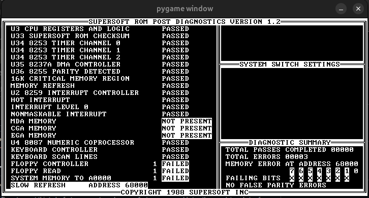
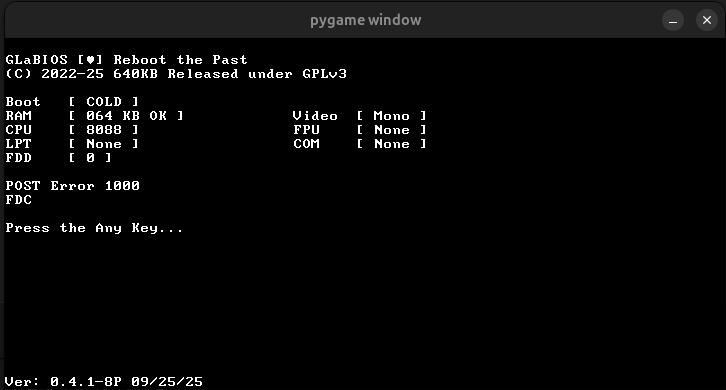
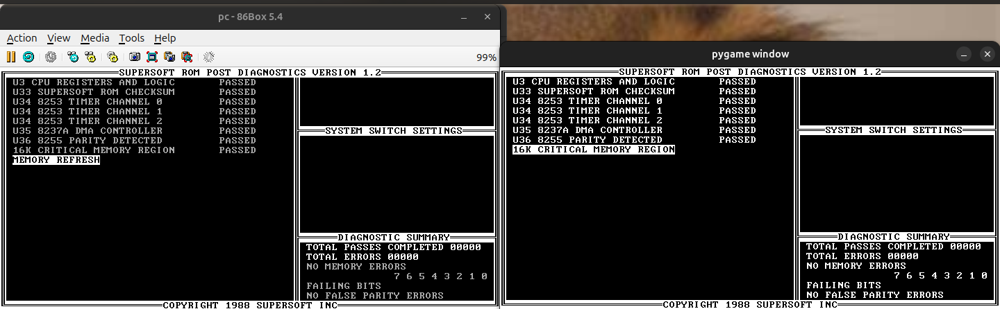

# py-pc-emu
IBM PC emulator written in python, using the Unicorn library for CPU emulation.

Note: Do not expect this to be fast, or accurate, or have any features comparable to other emulators. Lots of parts of this are unfinished, however it is functional enough to pass most diagnostic ROMS on everything but Floppy Read and Floppy Controller. Other than that it is currently useless as I have not implemented the FDC as of writing this (however that will hopefully change in the future). This is only a fun little project I wanted to try to get better at OOP (Object Oriented Programming), Python, and emulation.

# How do i use it?
All you need is the [unicorn library](https://github.com/unicorn-engine/unicorn), the pygame library, the pillow library, and this code. Simply clone this repository, then download the unicorn library,the pygame library, and the pillow library:

```pip install unicorn pygame pillow```

You can also just run the following from the repository root to do the same thing:

```pip install -r requirements.txt```

Then to run it you can just run main.py, which by default should run the Supersoft Diagnostic ROM

```python main.py```

Additionally, if you don't want to use my main.py script and you want to make your own, all you need to do is import PC from board.pc, create an instance of PC, pass the romfile location into it, and then run the mainloop by using pc.run:

```
from board.pc import PC

pc = PC("romfile path goes here")
pc.run()
```

You can also not pass the romfile argument into PC and it will run [GLaBIOS](https://github.com/640-KB/GLaBIOS) from ./cpu/pc_bios.bin, this should be present in the repo by default.

# Screenshots


Note: ignore the memory errors, I believe there is a bug in supersoft diagnostics where it always runs a test on 640K of memory, despite my emulator only emulating 64K of memory.




# Credits
Special thanks to:
 - The [OSDev Wiki](https://wiki.osdev.org/) for being a great resource for many parts of the development so far.
 - The [Unicorn Engine](https://github.com/unicorn-engine/unicorn) for making the CPU much simpler to implement.
 - [GLaBIOS](https://github.com/640-KB/GLaBIOS) for creating a bios that made debugging much easier thanks to the in-depth documentation.
